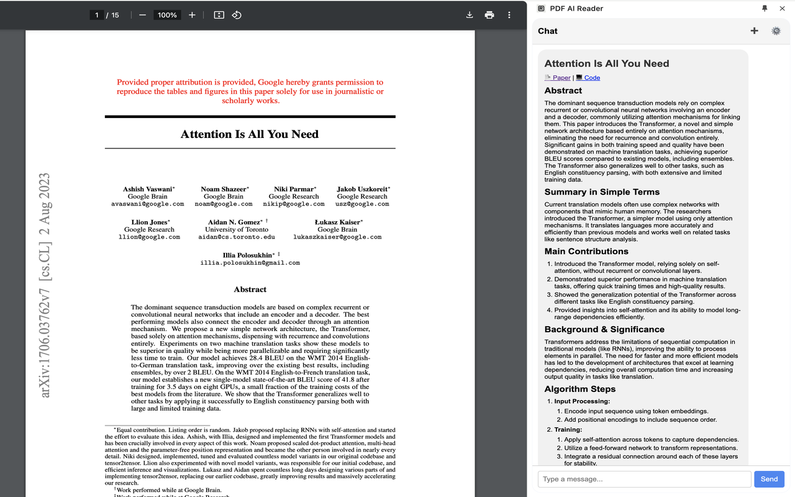

# PDF AI Reader Chrome Extension

  

## Description
A Chrome extension that allows you to chat with PDFs using AI. Currently supports only OpenAI GPT-4o model. You will need OpenAI API key to use this extension.

## Installation

1. Download or clone this repository
2. Open your browser and navigate to `chrome://extensions/`
3. Enable "Developer mode" (usually a toggle in the top-right corner)
4. Click "Load unpacked" and select the directory containing this extension
5. The extension should now appear in your browser toolbar

## Features
- Chat with PDFs using AI powered by OpenAI's GPT-4o model
- Auto-summarization of PDFs with custom prompt (developed specifically for AI/ML papers)
- Persistent PDF context even after clearing chat history
- Easy-to-use interface integrated directly into your PDF viewing experience

## Usage
1. Click the extension icon in your browser toolbar to activate
2. Open any PDF file in your Chrome browser
3. Configure your OpenAI API key in the extension settings:
   - Click the gear icon
   - Enter your API key
   - Save settings

## Contact
Kate - [@deyneka_e](https:/x.com/deyneka_e) - kvdeyneka@gmail.com